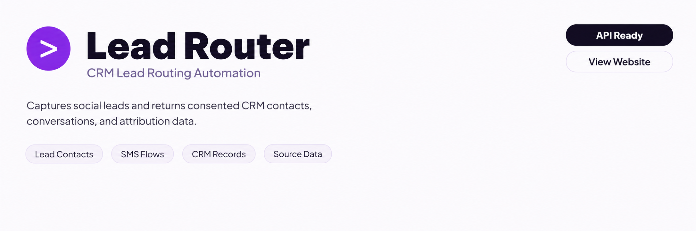

<p align="center">
  <a href="https://www.cogworklabs.com/tool/lead-response-automation-sms-routing" target="_blank">
    
  </a>
</p>

<p align="center">
  <a href="mailto:hello@cogworklabs.com" target="_blank">
    
  </a>&nbsp;
  <a href="https://www.cogworklabs.com" target="_blank">
    
  </a>
</p>

## CogWorkLabs' lead response automation

CogWorkLabs' lead response automation connects social ad submissions with consented conversations, CRM opportunities, and follow-up tracking for HVAC service teams. The build addresses the gap between someone requesting service online and an office team having enough context to respond.

> Turn incoming service interest into tracked conversations without losing the source data behind each request.

A submitted lead becomes a contact record with campaign details, service intent, consent records, and routing rules. The workflow uses [HighLevel workflows](https://help.gohighlevel.com/support/solutions) for contact management, opportunities, conversations, calendars, and conditional follow-up actions.

## CRM follow-up system design

Home-service inquiries often arrive while technicians are working, phones are busy, or offices are closed. This build removes the manual transfer between advertising platforms, intake forms, and pipeline stages. ServiceTitan's consumer research reports that 80% of homeowners begin their search online, while Invoca's home-services benchmark analyzed more than 60 million calls and found that only 55% reached a person.

The workflow keeps campaign identifiers attached from submission through appointment status. For social campaigns, the intake follows the structure described in [Meta Lead Ads documentation](https://developers.facebook.com/docs/marketing-api/guides/lead-ads/) and stores source fields before routing begins.

## Core Features

| Feature | Description |
| --- | --- |
| Social Lead Intake | Scattered ad responses create gaps between marketing and operations. The workflow normalizes names, phones, emails, campaigns, ad sets, creative identifiers, service requests, and timestamps into one contact record. |
| Texting Opt-In Capture | Unclear messaging permission creates compliance issues. The form stores consent language, submission time, source URL, and opt-out status before any messages are sent. |
| Timed Message Sequences | Slow follow-up can leave urgent repair requests unanswered. The workflow sends acknowledgements and scheduled reminders that stop after replies, bookings, or opt-outs. |
| HVAC Request Routing | Different inquiries need different handling. Contacts branch by repair, replacement, maintenance, indoor air quality, or unknown intent with matching tasks and questions. |
| Reply and Appointment Control | Active prospects should not receive unnecessary reminders. Replies pause follow-up, create ownership tasks, and appointment events trigger confirmation steps. |
| Campaign Attribution Records | Teams cannot compare channels when source information disappears. UTM values and social identifiers remain connected to contacts and opportunities. |
| Failure and Audit Logging | Silent workflow failures leave submissions untouched. The supporting service records webhook receipt, validation, API errors, retries, and final status. |

## Technical implementation and tracking

The orchestration layer runs around HighLevel records, while a TypeScript service receives social webhooks, validates payloads, normalizes fields, and prevents duplicate creation with idempotency keys. API communication follows documented patterns from [HighLevel API documentation](https://marketplace.gohighlevel.com/docs/) and webhook events are verified before contact updates occur.

Messaging rules retain consent details and STOP handling records based on guidance from [CTIA messaging principles](https://www.ctia.org/the-wireless-industry/industry-commitments/messaging-interoperability-sms-mms) and [FCC consumer guidance](https://www.fcc.gov/general/telemarketing-and-robocalls). The system treats permission as stored data rather than an assumption from an advertisement click.

```text
hvac-funnel/
├── src/
│   ├── server.ts
│   ├── webhooks/
│   │   ├── meta-leads.ts
│   │   └── verify-signature.ts
│   ├── highlevel/
│   │   ├── api.ts
│   │   ├── contact-upsert.ts
│   │   └── workflow-entry.ts
│   ├── tracking/
│   │   └── utm-normalizer.ts
│   ├── audit-log.ts
│   └── retry-queue.ts
├── config.ts
├── workflow-map.md
├── snapshot-manifest.json
├── custom-fields.json
├── pipeline-stages.json
└── tests/
    ├── lead-intake.test.ts
    ├── deduplication.test.ts
    ├── reply-stop.test.ts
    └── attribution.test.ts
```

## Performance checks before deployment

Acceptance testing focuses on predictable handling rather than conversion promises. A valid webhook is expected to receive acknowledgement within 2 seconds, contacts should enter the correct workflow within 30 seconds, and duplicate delivery of the same lead ID should create one contact and one opportunity.

- After-hours repair requests: capture urgency details and place contacts into a callback queue for the appropriate team.
- Replacement estimate campaigns: separate replacement interest from repair requests and assign the opportunity to the right advisor.
- Seasonal maintenance promotions: preserve campaign origin while stopping reminders after appointments are booked.
- Multi-location HVAC groups: route contacts by service area while maintaining shared campaign tracking.

## How to Configure Using CogWorkLabs' lead response automation

- **STEP 1 — Download & Set Up the Project** Download, set up, and install [**CogWorkLabs' lead response automation**](https://www.cogworklabs.com/tool/lead-response-automation-sms-routing) to get the project running. If you hit any difficulty, contact the team through the product page.
- **STEP 2 — Connect Intake Sources** Add the social lead webhook, map phone and consent fields, and confirm campaign identifiers enter the contact record.
- **STEP 3 — Select Routing Rules** Configure service branches, ownership rules, reminder timing, appointment calendars, and stop conditions for replies or opt-outs.
- **STEP 4 — Verify Output** Submit a test lead, review workflow entry, confirm opportunity creation, and check stored attribution values.

## Related automation services

CogWorkLabs also builds [workflow automation](https://www.cogworklabs.com) around existing systems, including custom deployments, integration work, feature changes, and ongoing maintenance for operational teams.

```bash
npm install
npm run test
npm run start
```

## FAQ

### How does the workflow handle SMS consent and opt-outs?

The workflow stores consent language, timestamps, source information, and opt-out status before sending messages. STOP handling and reply states prevent additional follow-up after a contact withdraws permission.

### Can the system separate different HVAC service requests?

Yes. Contacts can branch by repair, replacement, maintenance, indoor air quality, or unknown intent. Each path can apply different questions, tasks, and follow-up actions.

### How are campaign sources tracked after a lead submits a form?

Campaign identifiers and UTM values are retained on the contact and opportunity records. This allows teams to compare original sources against appointment and pipeline activity.